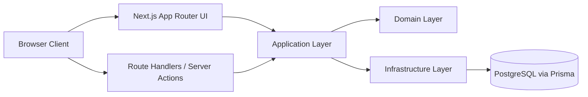
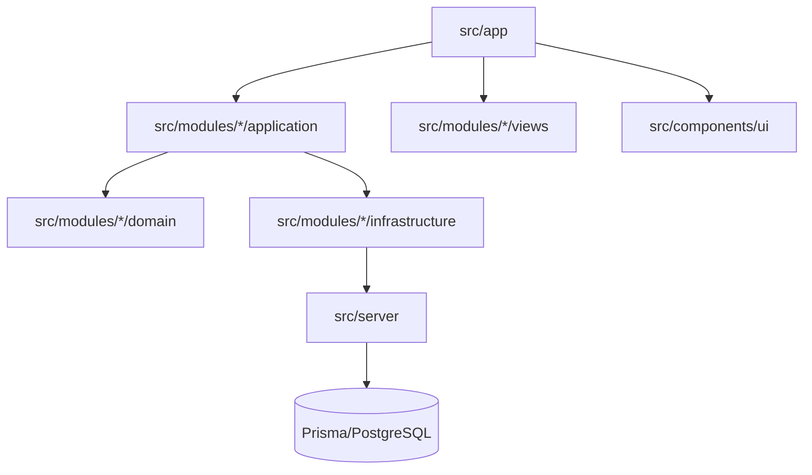

# Architecture Overview

> Status: living document (team agreement)  
> Project: VIERNULVIER archiefwebsite  
> Scope: foundation + long-term richting
---

## Technologische baseline

- Frontend: React (via Next.js App Router)
- Backend/BFF: Next.js Route Handlers + Server Actions
- Database: PostgreSQL
- ORM: Prisma
- Testing: Jest (unit/integration), E2E voor end-to-end flows
- Server/proxy in deployment: Nginx (infra/deployment context)

---

## Hoge-level architectuur



Kernidee: UI en API zijn entrypoints; businessregels zitten lager; DB toegang zit volledig in infrastructure.

---

## Doelstructuur van de codebase

```txt
src/
  app/                    # routes, layouts, pages, route handlers
  components/
    ui/                   # gedeelde UI primitives (o.a. shadcn)
  modules/
    <feature>/
      domain/             # entities, value objects, repository interfaces
      application/        # use-cases, DTO mapping, orchestratie
      infrastructure/     # prisma repositories, external adapters
      views/              # feature-specifieke UI componenten
      index.ts            # publieke module-export
  server/                 # server-only adapters (prisma singleton, auth, logger)
  shared/                 # cross-cutting types, validation, helpers
  config/                 # env parsing en app config

prisma/
tests/
docs/
```

---

## Wat hoort waar?

| Layer | Verantwoordelijkheid | Mag wel | Mag niet |
|---|---|---|---|
| `domain` | Pure businessregels | entities, value objects, invarianten, repository interfaces | Next.js imports, Prisma imports, HTTP details |
| `application` | Use-cases/workflows | orchestratie, authz checks, mapping naar DTO | UI rendering, SQL/Prisma queries direct |
| `infrastructure` | Technische implementatie | Prisma repositories, externe API adapters | businessregels uitvinden |
| `views` | Feature UI | feature-componenten, schermcompositie | complexe businessbeslissingen |
| `src/components/ui` | Gedeelde UI primitives | knoppen, input, modal, table, design tokens | feature-specifieke businesscomponenten |
| `src/app` | Entrypoints | routing, request parsing, response mapping | domeinregels en datalogica |

---

## Dependency regels



Regels:

1. `src/app` bevat geen businesslogica.
2. Prisma calls gebeuren enkel in `infrastructure` (of expliciete server adapters).
3. `domain` kent geen Next.js en geen Prisma.
4. Modules gebruiken elkaars interne files niet direct; enkel publieke exports (`index.ts`).
5. `server/*` wordt nooit geïmporteerd vanuit `'use client'` files.

---

## Request handling patroon

### API request

1. Route Handler ontvangt request.
2. Inputvalidatie (schema-first, bv. Zod).
3. Handler roept use-case aan.
4. Use-case gebruikt domain + repositories.
5. Infrastructure leest/schrijft via Prisma.
6. Handler retourneert JSON DTO met juiste statuscode.

### Page rendering

1. `page.tsx` haalt data via application/use-case.
2. Data wordt gepresenteerd via `views` + `components/ui`.
3. Client Components worden alleen gebruikt waar interactie nodig is.

---

## Auth vs IAM

- **Auth (authentication)**: verifieert identiteit (`wie ben je?`).
  - login, logout, session/token, password checks.
- **IAM (identity and access management)**: beslist toegangsrechten (`wat mag je?`).
  - rollen, permissies, policy checks.

Volgorde in elke gevoelige flow: **eerst auth, daarna IAM check**.

---

## Testfilosofie

- **Unit tests**: domain + application (snel, zonder echte DB).
- **Integration tests**: route handlers + infrastructure adapters met testdatabase.
- **E2E tests**: belangrijkste gebruikersflows en permissiegedrag.

Architectuurdoel: testbaarheid mag niet achteraf "toegevoegd" worden; de structuur moet dit vanaf start ondersteunen.

---

## Evolutie en wijzigingen

- Grote wijzigingen aan structuur of regels documenteren we als ADR in `docs/architecture/adr/`.
- Zonder ADR blijft dit document de bron van waarheid.
- Kleine verbeteringen zijn welkom, zolang de kernprincipes (scheiding van lagen, testbaarheid, modulegrenzen) behouden blijven.
